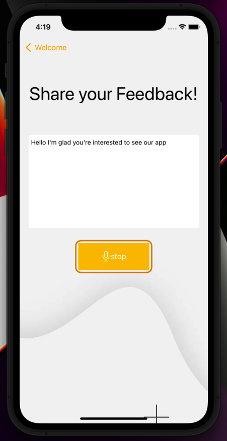

# Quiz App

## Project Description

Test me - is a quiz application where user can check his/her performance on different technologies like Java, iOS , Android etc to know improvement area. User can have free or subscribed account to attempt different number of quiz. It also has an admin login where admin can create different quizzes and has right to delete a user. 

## Technologies Used

* iOS- version 15.0
* Swift - version 5.0
* SQLite - version 3.12.2

In this project we have learned and applied fundamntal concepts for implementation of SQLite keyChain, userdefaults, animation, and a combination of SwiftUI with UIKit in multiple locations.  as well as the administration of a software engineering project (scrum)

## Features

List of features ready and TODOs for future development
* Manager can delete or add new users
* Manager can create new quiz database
* User can pick one of various quizes
* Quiz has timer, wrong answers with gravity animations

## Getting Started
* Use the link below to clone our project to you Xcode
>( https://github.com/stephaniemarin/Quiz-App.git )

* Use the Admin and password below for interacting as a Manager.
> log in as Admin with (Admin) and (00000) for password

## Quiz App Images
> Admin Home:  
> 

> ADMIN CREATE DATABASE:  
> 

> User Home:
> 

> Quiz Advance SwiftUI:
> 

> Wrong Answer:
> 

> Voice to Text Feedback:
> 

## Contributors

> Stephen Weber
> 
> Stephanie Marin

## Thank you :)

